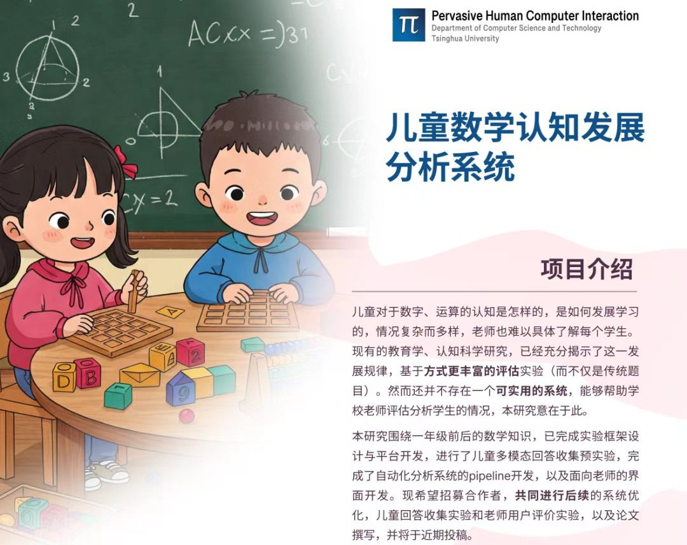
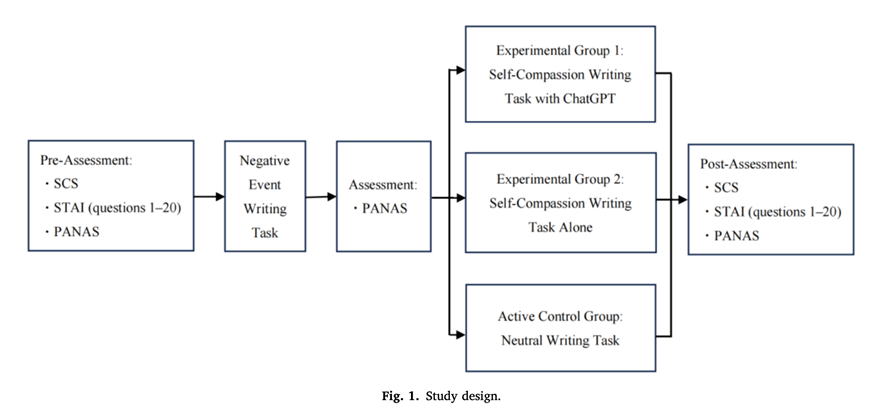
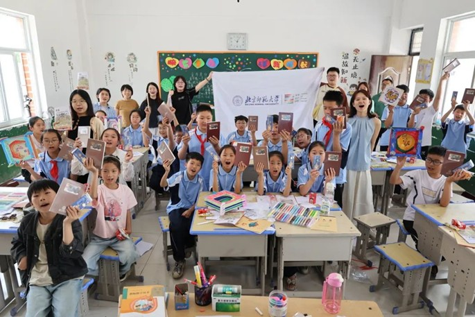
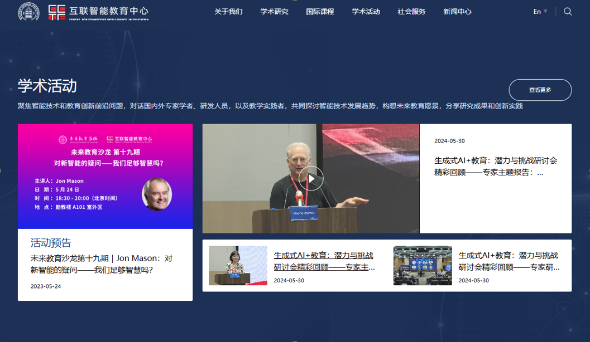
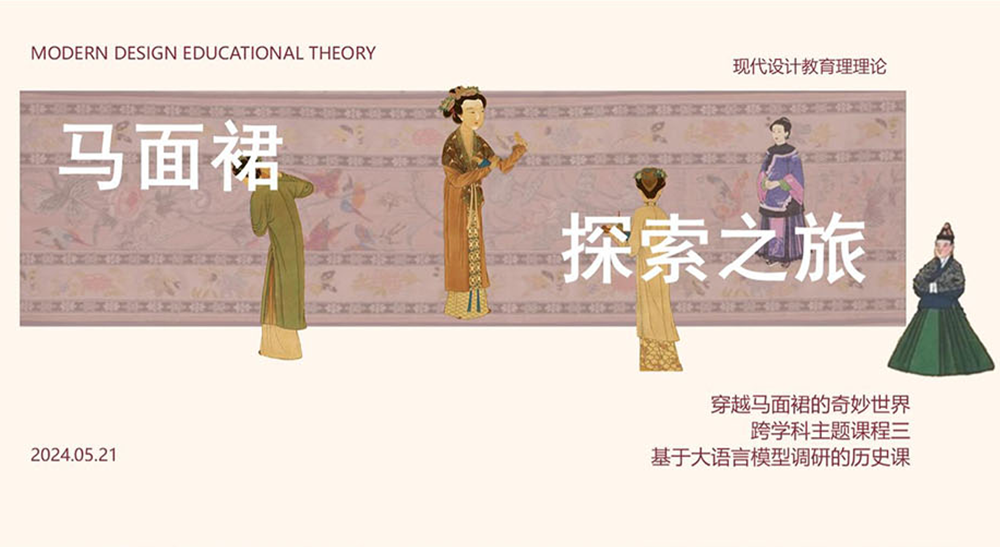








我是方一羽，在北京师范大学取得艺术设计专业硕士学位，一名专注于用户体验研究、人机交互与教育科技领域的探索者，拥有教育学与设计学的复合硕士背景。
我热衷于从模糊的需求中挖掘真实的洞察，并推动研究成果最终落地。期待能将我的专业与热情，投入到富有挑战的用户体验项目中。

# 🔥 News
- *2025.10*: &nbsp;🎉🎉 2024-2025学年 总成绩年级第一名. 

# 💻 实习经历

实习生（2025.5-7）

## 清华大学计算机系人机交互实验室 儿童数学认知发展分析系统

- **研究内容**：本研究围绕一年级前后的数学知识，已完成实验框架设计与平台开发，进行了儿童多模态回答收集预实验，完成了自动化分析系统的pipeline开发，以及面向老师的界面开发。主要负责形成性研究、专家访谈以及文献调研与分析。
- **情境**：参与研发一套基于多模态数据的儿童数学能力形成性评估系统，初期面临如何将数学数感发展认知理论转化为有效评估指标的关键挑战。
- **任务**：负责通过系统的前期研究、专家访谈，定义核心评估维度和用户体验需求，为系统设计提供科学输入。
- **行动**：主导10余场半结构化专家访谈（对象为小学一线数学教师、学生、数学教育领域专家等），运用主题分析法对访谈内容进行编码，提炼出“即时反馈”与“认知轨迹可视化”等核心需求。基于研究发现，参与构建“数感评估-行为反馈-路径干预”的评估平台功能。
- **结果**：将数感相关学术理论和真实的儿童数学发展需求以及生成式人工智能如何进入教学课堂的挑战，转化为清晰的产品需求，构建的研究框架为后续实验设计与开发奠定了基础，相关成果已整理成文拟投2025CHI。

实习生（2024.11-2025.6）

## 北师大艺术与科技实验室 你深知我的历程：运用大语言模型赋能自我关怀写作干预中的个性化理解与共情

- **研究内容**：主导探索大语言模型（LLM）如何增强自我关怀写作体验的混合方法用户研究。利用大语言模型（LLMs）来增强或辅助传统的自我关怀写作练习。LLMs 因其强大的自然语言处理和上下文理解能力，能够在这个过程中提供更个性化（Personalized）和富有共情（Empathy）的互动与支持。
- **研究方法设计**：研究采用混合方法研究设计，结合定量和定性方法，全面评估LLM增强的自我同情写作干预的效果和体验。
- **系统开发**：基于现有LLM技术(如GPT-4)开发写作干预平台，整合两个研究思路的核心功能。
- **用户研究**：招募参与者进行为期4-8周的写作干预研究，定量评估心理健康指标的变化，定性收集用户体验反馈。
- **效果评估**：综合分析定量与定性数据，评估LLM干预对用户体验的实际效果，比较不同实验条件的差异，为AI心理辅助产品设计提供关键洞察。

内容编辑与课程开发（2023.10-2024.6）

## 故宫学校出版社 故宫文化教育产品 少儿读物到美育课程设计与落地

- **用户研究与产品定义（读物阶段）**：通过在北京、珠海等地组织12场深度访谈与焦点小组，收集200+份小学美术课案例，精准洞察儿童对互动性、视觉探索的强烈偏好。据此创建用户画像与旅程图，指导产品方向。
  - **产品决策**：研究发现儿童在互动性、视觉探索及与自然关联上有更强偏好性，成功说服团队将植物、动物纹样优先设立为读物核心亮点，并参与设计了专属IP动物形象以提升亲和力。
  - **框架搭建**：基于2022新课标拆解美育目标，创新性提炼出“结构-色彩-纹样”三维课程框架，开发奠定了课程理论基础。
- **课程开发与教学落地（课程阶段）**
  - **内容转化**：将读物内容转化为可执行的课程体系，主导设计以故宫藻井纹样为核心的课程（含结构、色彩、纹样三模块）。
  - **教具创新**：开发配套实体教具包（含藻井模型、纹样设计卡等6类工具），通过实践应用深化文化认知与审美创造。
  - **跨地实践**：推动课程在珠海（城市小学）、河南（乡村小学）等不同地域的学校成功落地，验证了课程体系的普适性与适应性。

科研助理（2024.3-至今）

## 北京师范大学智能互联教育研究中心 关于生成式人工智能促进教师专业发展的研究

- **情境**：在生成式AI兴起背景下，探索LLM如何有效赋能教师专业发展，缺乏科学的评估体系来衡量其实际效果。
- **任务**：构建一套可量化的评估模型，客观评估AI工具对教学各环节的影响。
- **行动**：通过文献综述和教师预访谈，构建了包含4个维度（学生作业质量、教学设计创新性等）和12个具体指标的评估模型，确保其信度和效度。收集210份学生作业、教案及问卷数据，利用SPSS进行定量分析（如T检验），对比使用AI前后的差异。不仅验证了AI工具在提升反馈效率等方面的有效性，更形成了一套可复用的评估方法论。
- **结果**：为AI教育应用的有效性提供了数据驱动的证据链，该评估模型可作为持续追踪工具，支持产品迭代决策北师大设计教育实验室.

课程设计（2024.3-2024.8）

## 北京师范大学未来设计学院 人工智能教育跨学科课程研发

- **课程设计**：主导设计并实施PBL跨学科主题课程《穿越马面裙的奇妙世界——基于大语言模型的传统文化创新研究》，构建"语文+历史+AI技术"的三维课程框架。
- **课程内容**：通过大语言模型（LLM）进行文献挖掘与数据分析，提炼马面裙纹样符号的文化内涵，开发出AI辅助的传统文化探究工具包，并使用差分检测进行对比分析。完成语文、信息技术、历史共3套跨学科学习方案设计，涵盖项目式学习手册、互动课件。核心课例入选《"语文+X"跨学科主题学习实践案例集》（陈志红主编，2025年待出版），形成可复制的传统文化教育技术融合范式。

# 📖 教育背景
- *2023.09 - 2026.06*，北京师范大学 艺术设计 硕士（GPA3.7/4 年级排名第一）
- *2020.09 - 至今*，云南大学 法学 学士
- *2017.09 - 2021.06*，昆明学院 学前教育 学士

# 🎖 荣誉
- *2025.10* 北京师范大学研究生学业一等奖学金 
- *2024.10* 北京师范大学研究生学业二等奖学金
- *2021.06* 本科优秀毕业论文

# 📝 学术成果

#### 论文
- 王楠楠, **方一羽**, 谢瑞麟. 智能辅助设计：将机器学习方法论引入思辨性设计的通识课程[C]. 未来设计学术论坛. 2022
- **方一羽**, 徐腾飞, 基于C-STEAM理念的教学实践探究——以珠海市金凤小学为例. 美术观察（在审）
- Shiyu Liu, Kin Wai Michael Siu, Qi Zhao, Yuanxin Guo, **Yiyu Fang**. Preparing Educators for an Emerging Future: A Case Study on Life Design Training for Pre-service Teachers in China. Journal of Teacher Education（在审）
- **方一羽**, 袁莉, 孙梦 生成式AI+教育：潜力与挑战研讨会综述 电化教育研究（在投）

#### 学术海报
- **方一羽**, 赵紫宏, 黄雯雯, 付红昕. Searching for Patterns in the For bidden City —AIGC interactive exploration experience based on the window lattice of the Forbidden City[C]. The first Global Alliance of Educational Leaders and Department Heads. 2024.

#### 专著
- 徐腾飞. **方一羽**, 林菡, 卢言欢, 安瑷雯. 王莹 中外美术简史.清华大学出版社 2025（三校）

#### 专利
- 酒瓶外包装 [P]:ZL 2022 3 0128097.X. 外观设计专利
- 一种家庭远程视频对话装置 [P]:2023203843263；实用新型专利
- 一种组合式蒸汽咖啡机多用桌 [P]:2022230192496. 实用新型专利
- 加湿器 [P]:CN 201028724Y. 实用新型专利

